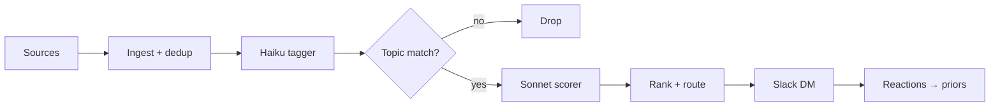

# 📰 News agent

[](https://docs.python.org/3/)

A self-hosted agent that watches your topics across live sources, filters noise with a two-pass LLM, and delivers compact digests to your Slack DM 💬. Nothing leaves your machine except LLM calls. ~$2–4/month.

* [Getting started](#getting-started)
* [How it works](#how-it-works)
* [Configuration](#configuration)
* [Sources](#sources)
* [Delivery](#delivery)
* [CLI](#cli)

## Getting started

Install [uv](https://docs.astral.sh/uv/) — no Homebrew or admin rights required:

```bash
curl -LsSf https://astral.sh/uv/install.sh | sh
source ~/.zshrc
```

Clone and install:

```bash
git clone https://github.com/polurezov8/news-agent.git
cd news-agent
uv sync --extra dev
```

Copy and fill the env file:

```bash
cp .env.example .env
```

Minimum required:

```bash
ANTHROPIC_API_KEY=sk-ant-...   # LLM pipeline
SLACK_BOT_TOKEN=xoxb-...       # post messages
SLACK_APP_TOKEN=xapp-...       # Socket Mode listener
SLACK_USER_ID=U0XXXXXXX        # your Slack member ID
```

Verify:

```bash
uv run news-agent --help
uv run pytest tests/unit/ -q    # 50 passed
```

### Slack app setup

Create an app at [api.slack.com/apps](https://api.slack.com/apps), enable Socket Mode, and add these scopes:

| Scope | Purpose |
|---|---|
| `chat:write` | post digests and DMs |
| `im:write` | open DM conversation |
| `reactions:read` | receive reaction feedback |

Add a `/news` slash command and subscribe to the `reaction_added` event.

### Twitter/X sources

Requires Docker. Once Docker Desktop is installed:

```bash
docker compose up -d rsshub
curl http://localhost:1200/healthz    # {"status":"ok"}
```

Set `TWITTER_AUTH_TOKEN` and `TWITTER_CT0` from your Twitter cookies in `.env`.

## How it works

Articles flow through a fixed pipeline. Haiku tags cheaply; Sonnet scores only the ~20% that survive the topic filter. Every score component is stored and queryable.



Scoring formula:

```
final = (substance + tag_adj) * decay * source_weight
        ↑           ↑           ↑       ↑
        Sonnet      tag boosts  recency  per-(source, topic)
        0..1        ±adj        decay    prior weight
```

The key design decision: tags describe what an article *is* (stable, vocab-bounded, cached across sources), while topics describe what *you care about* (personal queries over tags, freely editable). Changing a topic never re-runs the tagger.

## Configuration

Four YAML files in `config/`. Empty templates ship; `news-agent init` walks you through setup.

### tags.yaml

Controlled vocabulary. The LLM assigns tags only from this list. New suggestions are logged to the `tag_suggestions` table for weekly review.

```yaml
tags:
  domain:
    - <tag>
  type:
    - news
    - essay
    - tutorial
    - paper
    - tool
  quality:
    - hands_on
    - first_person
    - data_driven
```

### topics.yaml

Topics are saved queries over the tag vocabulary. Composable, A/B-able, debuggable.

```yaml
topics:
  <topic_id>:
    label: <human label>
    query:
      must_have_any: [<tag>, ...]
      must_not_have: [<tag>, ...]
      boost:
        - { tags: [<tag>], weight: +0.3 }
      penalize:
        - { tags: [<tag>], weight: -0.1 }
    recency:
      half_life_days: 7
    nl_rules:
      - "prefer actionable content over speculation"
    delivery:
      digest_top_n: 5
      priority_threshold: 0.9
      priority_recency_hours: 24
```

### sources.yaml

```yaml
sources:
  - id: hackernews
    type: hackernews
    config: { min_points: 100, limit: 30 }
    topics: [<topic_id>]
    weight: 0.8
```

### source_priors.yaml

Per `(source, topic)` weights. A source can be signal for one topic and noise for another.

```yaml
priors:
  - { source: hackernews, topic: <topic_id>, weight: 0.9 }
```

## Sources

| Type | Key config |
|---|---|
| `rss` | `url` |
| `hackernews` | `min_points`, `limit` |
| `arxiv` | `categories`, `max_results` |
| `github_trending` | `language`, `since` (daily/weekly/monthly), `min_stars_today` |
| `lobsters` | `min_score`, `tags` |
| `rsshub_twitter_list` | `list_id`, `rsshub_base_url` |
| `safari_reading_list` | `write_back` |

## Delivery

All messages arrive in your Slack DM. Each item shows a score bar and four feedback buttons:

```
Article title
`source` · score 0.87 [████████░░]
[👍 Boost]  [🔖 Save]  [💤 Skip]  [❌ Demote]
```

Reactions also work inline: 👍 boost · 💤 skip · ❌ demote · 🔖 save.

| Cadence | When | Content |
|---|---|---|
| Daily digest | 09:00 local | Top-N per topic, global max 10 |
| Priority DM | Real-time | Score above topic threshold within freshness window |
| Weekly recap | Sunday 10:00 | Top of week + high-score items you skipped |
| On-demand | `/news` | Run pipeline immediately |

## CLI

```bash
news-agent                  run pipeline
news-agent slack            start Slack Socket Mode listener
news-agent slack --demo     post a sample digest to verify formatting
news-agent status           counters and cost MTD
news-agent doctor           health checks
news-agent init             interactive setup wizard
```

