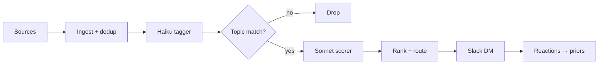

# 📰 News agent

[](https://docs.python.org/3/)
[](#tests)
[](#)
[](LICENSE)

A self-hosted agent that watches your topics across live sources, filters noise with a two-pass LLM, and delivers compact digests to your Slack DM. Nothing leaves your machine except LLM calls (~$2–4/month).

---

- [Getting started](#getting-started)
- [How it works](#how-it-works)
- [Configuration](#configuration)
- [Sources](#sources)
- [Delivery](#delivery)
- [Hosting](#hosting)
- [CLI](#cli)
- [Tests](#tests)

---

## Getting started

Install [uv](https://docs.astral.sh/uv/) — no Homebrew or admin rights required:

```bash
curl -LsSf https://astral.sh/uv/install.sh | sh
source ~/.zshrc
```

Clone and install:

```bash
git clone https://github.com/polurezov8/news-agent.git
cd news-agent
uv sync --extra dev
```

Copy and fill the env file:

```bash
cp .env.example .env
```

Minimum required:

```bash
ANTHROPIC_API_KEY=sk-ant-...   # LLM pipeline
SLACK_BOT_TOKEN=xoxb-...       # post messages
SLACK_APP_TOKEN=xapp-...       # Socket Mode listener
SLACK_USER_ID=U0XXXXXXX        # your Slack member ID
```

Verify:

```bash
uv run news-agent --help
uv run pytest tests/unit/ -q    # 239 passed
```

### Slack app setup

Create an app at [api.slack.com/apps](https://api.slack.com/apps), enable Socket Mode, and add these scopes:

| Scope | Purpose |
|---|---|
| `chat:write` | post digests and DMs |
| `im:write` | open DM conversation |
| `im:history` | read your DM messages (chat assistant) |
| `reactions:read` | receive reaction feedback |

Add a `/news` slash command and subscribe to the `reaction_added` and `message.im`
events. `message.im` is what lets you talk to the agent in the DM (see [Chat](#chat)).

### Twitter/X sources

Requires Docker. Once Docker Desktop is installed:

```bash
docker compose up -d rsshub
curl http://localhost:1200/healthz    # {"status":"ok"}
```

Set `TWITTER_AUTH_TOKEN` and `TWITTER_CT0` from your Twitter cookies in `.env`.

---

## How it works

Articles flow through a fixed pipeline. Haiku tags cheaply; Sonnet scores only the ~20% that survive the topic filter. Every score component is stored and queryable.



Scoring formula:

```
final = (substance + tag_adj) * decay * source_weight + taste_adj
        ↑           ↑           ↑       ↑               ↑
        Sonnet      tag boosts  recency  per-(source,    reading-list
        0..1        ±adj        decay    topic) weight   interest (un-decayed)
```

`final` ranks the picks. The digest *gate* is the un-decayed **intrinsic interest**
(`substance + tag_adj + taste_adj`), not `final` — gating on `final` let recency
and source-weight (both < 1) shrink everything below the floor, which kept the
digest silent. Recency and trust now only order the picks, they don't veto them.

The key design decision: tags describe what an article *is* (stable, vocab-bounded, cached across sources), while topics describe what *you care about* (personal queries over tags, freely editable). Changing a topic never re-runs the tagger.

**Taste from your reading list.** Safari reading list is an *interest signal*, not a
news source: it never competes for digest slots. What you save — and especially what
you *read* (`DateLastViewed`) — updates a per-tag taste profile (domain + quality tags
only, so reading listicles doesn't surface more listicles). That profile is the
`taste_adj` term, so the agent finds more of what you read from your other sources. A
save→read happens after the item is already stored, so the read sync runs outside the
hash-dedup that would otherwise drop it.

---

## Configuration

Four YAML files in `config/`. Empty templates ship; `news-agent init` walks you through setup.

### tags.yaml

Controlled vocabulary. The LLM assigns tags only from this list. New suggestions are logged to the `tag_suggestions` table for weekly review.

```yaml
tags:
  domain:
    - <tag>
  type:
    - news
    - essay
    - tutorial
    - paper
    - tool
  quality:
    - hands_on
    - first_person
    - data_driven
```

### topics.yaml

Topics are saved queries over the tag vocabulary. Composable, A/B-able, debuggable.

```yaml
topics:
  <topic_id>:
    label: <human label>
    query:
      must_have_any: [<tag>, ...]
      must_not_have: [<tag>, ...]
      boost:
        - { tags: [<tag>], weight: +0.3 }
      penalize:
        - { tags: [<tag>], weight: -0.1 }
    recency:
      half_life_days: 7
    nl_rules:
      - "prefer actionable content over speculation"
    delivery:
      digest_top_n: 5
      priority_threshold: 0.9
      priority_recency_hours: 24
```

### sources.yaml

```yaml
sources:
  - id: hackernews
    type: hackernews
    config: { min_points: 100, limit: 30 }
    topics: [<topic_id>]
    weight: 0.8
```

### source_priors.yaml

Per `(source, topic)` weights. A source can be signal for one topic and noise for another.

```yaml
priors:
  - { source: hackernews, topic: <topic_id>, weight: 0.9 }
```

---

## Sources

| Type | Key config |
|---|---|
| `rss` | `url` |
| `hackernews` | `min_points`, `limit` |
| `arxiv` | `categories`, `max_results` |
| `github_trending` | `language`, `since` (daily/weekly/monthly), `min_stars_today` |
| `lobsters` | `min_score`, `tags` |
| `rsshub_twitter_list` | `list_id`, `rsshub_base_url` |
| `safari_reading_list` | `write_back` |

---

## Delivery

All messages arrive in your Slack DM. Typography does the work — date as headline, small-caps section labels, bold linked title with an italic meta line. No score bars, no button rows, no chrome.

```
Friday, May 22

⭐️  EDITOR'S PICK

Scaling Laws for Neural Language Models
arxiv · AI · this morning

✨  ALSO TODAY

SwiftUI для справжніх macOS-застосунків
iOSDevsUA · iOS · this morning

How Shopify ships big features in small slices
DOU · Engineering Leadership · 4h ago

1531 scanned · 9 on topic · 3 picks
```

**Feedback is binary:** react with 👍 to boost the source/topic, 👎 to demote. Two reactions, zero ambiguity. The listener daemon (`news-agent slack`, runs as a launchd job after `news-agent schedule install`) resolves the reacted message back to the article and updates `source_priors` for the learning loop.

| Cadence | When | Content |
|---|---|---|
| Daily digest | 10:00 local | Hard cap **3 picks total**: editor's pick + up to two also-today. Trusted-source guarantees fill first by recency; remaining slots by `final` score. Silent on empty days. |
| Priority DM | Real-time | One-item card under 🔔 PRIORITY when `final ≥ topic.priority_threshold` within the freshness window. |
| Weekly recap | Sunday 10:00 | ⭐️ TOP THIS WEEK + 💭 HIGH-SCORE BUT SKIPPED + 📌 FROM YOUR READING LIST (taste tags + topic suggestions) + footer: `runs · surfaced · boosted · demoted · top sources`. |
| On-demand | `/news` | Run the pipeline immediately. |

### Chat

DM the agent in plain language (requires the `im:history` scope and `message.im`
subscription above). A Sonnet tool-loop answers over your corpus:

- **find** — "anything on Swift macros this month?"
- **ask** — "what did you surface on TCA this week?", "what have you learned about me?"
- **status** — "how much have we spent?"
- **act** — "run now" (runs the pipeline), "boost pointfree", "demote DOU for AI"
  (nudges source trust). Side-effecting actions are confirmed in the chat first.

---

## Hosting

Two ways to keep the agent running:

| | macOS launchd | Docker (recommended) |
|---|---|---|
| Setup | `news-agent schedule install` | `docker compose up -d --build` |
| Runs when | Mac is awake & unlocked | always — survives restarts and sleep |
| Best for | trying it on your own Mac | a box you leave on (Pi, mini-PC, VPS) |

On a laptop you restart often, launchd silently skips every digest while the
machine is asleep, and priority DMs stop being real-time. The Docker stack runs
a 24/7 listener plus a [supercronic](deploy/crontab) scheduler on a host that
doesn't sleep.

**Your keys stay yours.** Hosting never commits or uploads your `.env` — it's
git-ignored and excluded from the image; secrets are injected at runtime. On
hardware you own, the trust profile is identical to your Mac. See
[`deploy/README.md`](deploy/README.md) for the full guide, including managed
hosts (Railway/Fly).

```bash
cp .env.example .env          # fill keys; set TZ to your timezone
docker compose up -d --build  # listener + cron + (optional) rsshub
```

---

## CLI

```bash
news-agent run [--cadence daily|priority|weekly] [--no-slack] [--dry-run]
news-agent slack            start Slack Socket Mode listener
news-agent slack --demo     post a sample digest to verify formatting
news-agent status           counters and cost MTD
news-agent doctor           health checks
news-agent backup [--dest PATH] [--keep N]
news-agent schedule install | uninstall | restart | status
news-agent init             interactive setup wizard
```

`--dry-run` previews the pipeline end-to-end — LLM calls still fire (and bill) but no articles/tags/scores are persisted and no Slack messages are posted. Use it before changing prompts or topic configs.

---

## Tests

```bash
uv run pytest tests/unit/ -q    # 239 tests
uv run ruff check src tests
```

---

[MIT](LICENSE) — © 2026 Dmytro Poluriezov.

